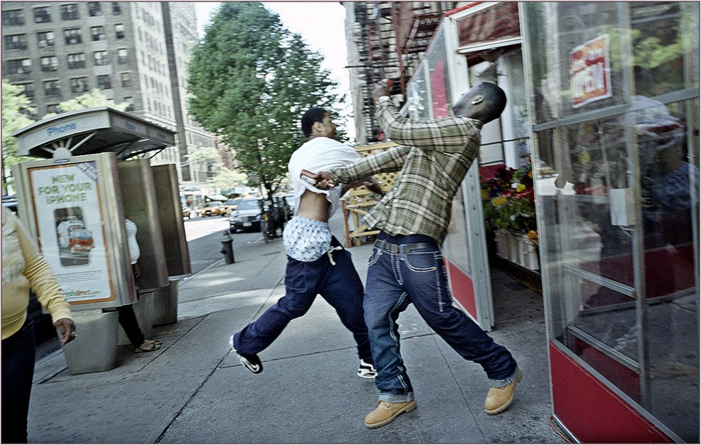
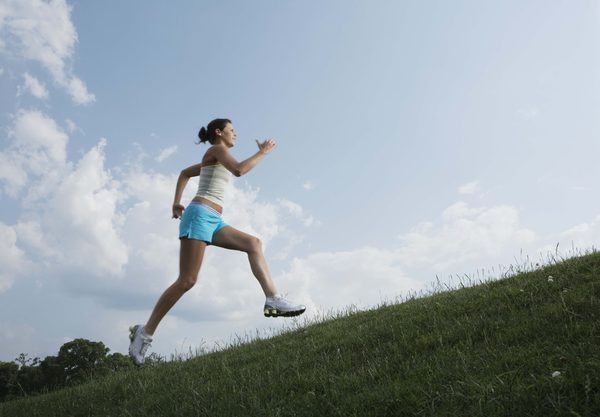

# Action-Net
Action-Net is a dataset containing images of 16 different human actions.
  

<b>Action-Net</b> is a dataset containing images of human actions , collected in order to ensure that machine learning systems can be trained
 to understand human actions, gestures and activities. This is part of <a href="https://deepquestai.com" >DeepQuest AI</a>'s to train machine learning systems to 
  perceive, understand and act accordingly in solving problems in any environment they are deployed.   

  This is the first release of the Action-Net dataset. It contains 19,200 images that span cover 16 classes. The classes
  included in this release are:   

  - <b> Calling </b>  
  - <b> Clapping </b>  
  - <b> Cycling </b>  
  - <b> Dancing </b>  
  - <b> Drinking </b>  
  - <b> Eating </b>  
  - <b> Fighting </b>  
  - <b> Hugging </b>  
  - <b> Kissing </b>  
  - <b> Laughing </b>  
  - <b> Listening to Music </b>  
  - <b> Running </b>  
  - <b> Sitting </b>  
  - <b> Sleeping </b>  
  - <b> Texting </b>  
  - <b> Using Laptop </b>  
  

  There are <b>1,200 images</b> for each category, with <b>1000 images for trainings </b> and <b>200 images for testing</b> . We are working on adding more
   categories in the future and will continue to improve the dataset.
      

  <b>>>> DOWNLOAD, TRAINING AND PREDICTION: </b>   
 The <b>Action-Net</b> dataset is provided for download in the <b>release</b> section of this repository.
 You can download the dataset via the link below.   <a href="https://github.com/OlafenwaMoses/Action-Net/releases/download/v1/action_net_v1.zip" >https://github.com/OlafenwaMoses/Action-Net/releases/download/v1/action_net_v1.zip</a>    

 We have also provided a python codebase to download the images, train <b>ResNet50</b> on the images
  and perform prediction using a pretrained model (also using <b>ResNet50</b>) provided in the release section of this repository.
  The python codebase is contained in the <b><a href="action_net.py" >action_net.py</a></b> file and the model class labels for prediction is also provided the 
  <b><a href="model_class.json" >model_class.json</a></b>. The pretrained <b>ResNet50</b> model is available for download via the link below.    
  <b><a href="https://github.com/OlafenwaMoses/Action-Net/releases/download/v1/action_net_ex-060_acc-0.745313.h5" >https://github.com/OlafenwaMoses/Action-Net/releases/download/v1/action_net_ex-060_acc-0.745313.h5</a></b> 
   
   This pre-trained model was trained for **60 epochs** only, but it achieved over **74%** accuracy on 3200 test images. You can see the prediction results on new images that were not part of the dataset in the **Prediction Results** section below. More experiments will enhance the accuracy of the model.
 
Running the experiment or prediction requires that you have **Tensorflow**, and **Keras**, **OpenCV** and **ImageAI** installed. You can install this dependencies via the commands below.

 <b>- Tensorflow 1.4.0 (and later versions)  </b>      <a href="https://www.tensorflow.org/install/install_windows" style="text-decoration: none;" > Install</a> or install via pip <pre> pip3 install --upgrade tensorflow </pre> 
       
  <b>- OpenCV  </b>        <a href="https://pypi.python.org/pypi/opencv-python" style="text-decoration: none;" >Install</a> or install via pip <pre> pip3 install opencv-python </pre> 
       
   <b>- Keras 2.x  </b>     <a href="https://keras.io/#installation" style="text-decoration: none;" >Install</a> or install via pip <pre> pip3 install keras </pre> 
  
   <b>- ImageAI 2.0.3  </b>  
         <pre>pip3 install imageai </pre>     

<b>>>> Video & Prediction Results</b>   
Click below to watch the video demonstration of the trained model at work.  

    
  
<pre>
eating  :  100.0
drinking  :  3.92037860508232e-09
using-laptop  :  6.944534465709584e-11
calling  :  5.7910951424891555e-12
</pre>

 

<pre>
eating  :  99.44907426834106
drinking  :  0.5508399568498135
using-phone  :  5.766927415606915e-05
sitting  :  1.1222620344142342e-05
</pre>

 

<pre>
fighting  :  99.97442364692688
running  :  0.01658390392549336
dancing  :  0.008970857743406668
sitting  :  7.210289965087213e-06
</pre>

 

<pre>
laughing  :  99.99998807907104
clapping  :  1.3144966715117334e-05
calling  :  4.0294068526236515e-06
eating  :  4.981405066217803e-07
</pre>

 

<pre>
running  :  99.99852180480957
calling  :  0.0009251662959286477
listening-to-music  :  0.0002909338491008384
cycling  :  0.00024121977730828803
</pre>

 

<h3><b><u>References</u></b></h3>

 
 1. Kaiming H. et al, Deep Residual Learning for Image Recognition  
 <a href="https://arxiv.org/abs/1512.03385" >https://arxiv.org/abs/1512.03385</a>   
